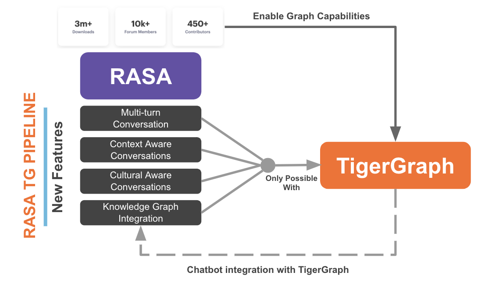
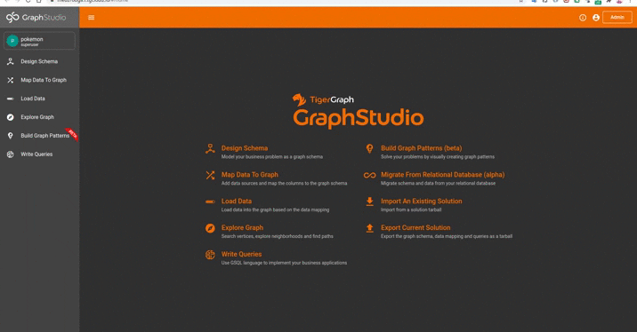

## RASA Unleashed with TigerGraph :



## Demo :



### Configuration :

please edit these variables

``` 
configs = {
    "host": "https://<your_box>.i.tgcloud.io",
    "password": "<your_password>",
    "graphname": "<your_graph>",
    "secret" : "<your_secret>"
    }
``` 
in :

``` 
rasaconnector/test.py
Covid-Chatbot/actions/actions.py

``` 


### Connector (test.py)


``` 
$ cd rasaconnector 
$ python3 -m virtualenv -p python3 .
$ source bin/activate
$ pip install requirements.txt
$ python3 test.py

``` 

### WEB  (Port 5000)

``` 
$ cd web 
$ python3 -m virtualenv -p python3 .
$ source bin/activate
$ pip install requirements.txt
$ python3 app.py

``` 

### Assistant (Port 5005)

``` 
$ cd Covid-Chatbot 
$ python3 -m virtualenv -p python3 .
$ source bin/activate
$ pip install requirements.txt
$ rasa train
$ rasa run --endpoints endpoints.yml --connector socketio --credentials credentials.yml --port 5005 --cors "*" --enable-api

``` 


### Actions Server (Port 5055)

``` 
$ cd Covid-Chatbot 
$ source bin/activate
$ rasa run actions

``` 


Please check the ToDo in Covid-Chatbot Folder for detailed Steps
